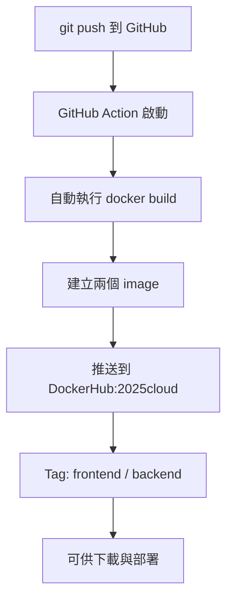

# cloud-native-assignment4

本專案包含兩個應用程式：
- `frontend`：以 Nginx 提供靜態頁面
- `backend`：以 Flask 實作簡單 API

---

## 🐳 Docker Build 指令說明

### 🔧 frontend（nginx）

```bash
cd frontend
docker build -t your_dockerhub_username/2025cloud:frontend .
```

### 🔧 backend（flask）

```bash
cd backend
docker build -t your_dockerhub_username/2025cloud:backend .
```

---

## 🚀 Docker Run 指令說明

### ▶️ frontend

```bash
docker run -d -p 8080:80 your_dockerhub_username/2025cloud:frontend
```

瀏覽器開啟 http://localhost:8080

### ▶️ backend

```bash
docker run -d -p 5000:5000 your_dockerhub_username/2025cloud:backend
```

瀏覽器開啟 http://localhost:5000

---

## 🤖 GitHub Action 自動化流程圖解



---

## 🌿 Docker Image Tag 設計原則

- frontend：`yourname/2025cloud:frontend`
- backend：`yourname/2025cloud:backend`

說明：
- 將兩個不同角色的應用整合在同一個 Repo (即 cloud-native-assignment4) 下，有利於集中管理與 CI/CD 整合
- 分別以 `frontend` 與 `backend` 為 Tag 區隔服務角色

---

## 📂 專案目錄結構

```bash
cloud-native-assignment4/
├── frontend/
│   ├── index.html
│   └── Dockerfile
├── backend/
│   ├── app.py
│   └── Dockerfile
└── .github/
    └── workflows/
        └── docker.yml
```

---

## 🧪 測試方式

### 查看容器是否正常執行：

```bash
docker ps
```

### 查看 image 是否存在：

```bash
docker images
```

---
